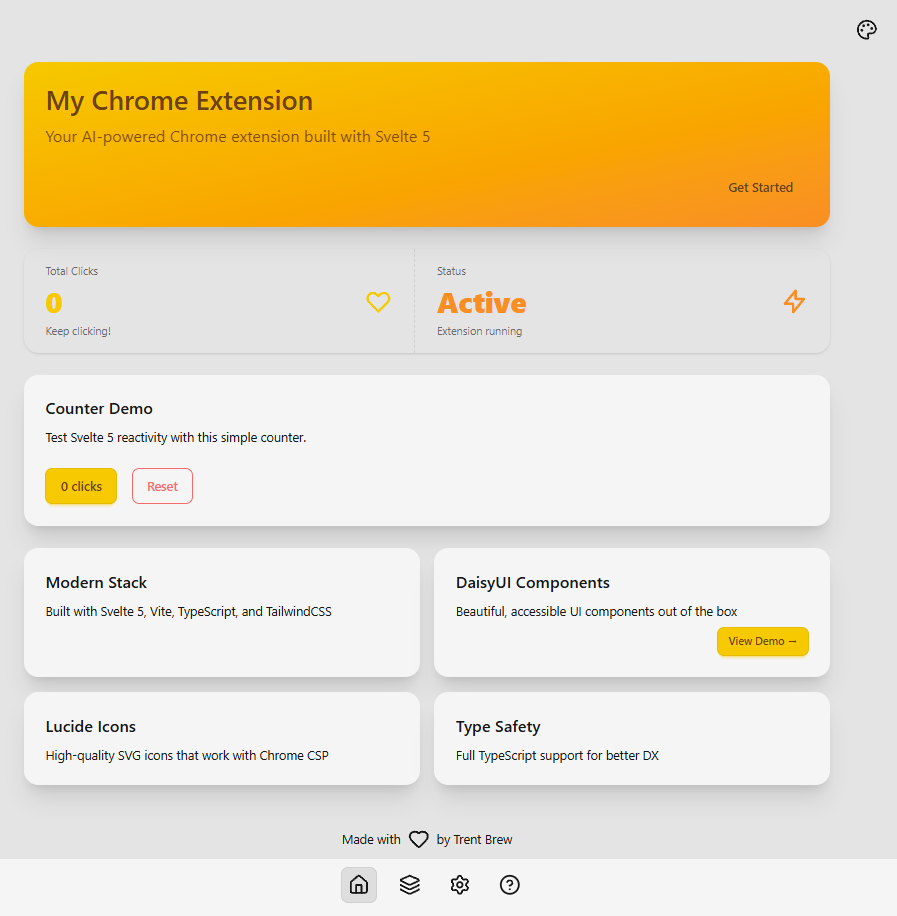

# Updated Svelte 5 Chrome Extension

This is a fork of [trentbrew/svelte5-chrome-extension](https://github.com/trentbrew/svelte5-chrome-extension), updated with the latest dependencies and Svelte 5 compatibility fixes.

## Goal

Update all dependencies to their latest versions, ensure no conflicts, and make the project ready to run locally. All deprecated components have been updated to the newest Svelte 5 standards, including:

- Reactive state with `$state()` rune
- Dynamic component rendering with `{@render}`
- Proper TypeScript types for Svelte 5
- Tailwind CSS v4 configuration with `@plugin` in CSS

---

## ✨ Features

- **[Vite](https://vite.dev/)**: Lightning-fast bundler for modern web development.
- **[Svelte 5](https://svelte.dev/docs/svelte/what-are-runes)**: Minimalistic framework for building user interfaces.
- **[TypeScript](https://www.typescriptlang.org/docs/handbook/intro.html)**: Static typing for better code quality and maintainability.
- **[TailwindCSS](https://tailwindcss.com/docs)**: Utility-first CSS framework for rapid UI development.
- **[DaisyUI](https://daisyui.com/)**: TailwindCSS-based components for faster styling.
- **[Chrome Manifest V3](https://developer.chrome.com/docs/extensions/develop/migrate/what-is-mv3)**: Secure and powerful API for Chrome extensions.

---

## 📦 Updated Dependencies

All dependencies have been updated to their latest versions for compatibility and security.

### Dev Dependencies

- **@sveltejs/vite-plugin-svelte**: ^6.2.1
- **@tailwindcss/postcss**: ^4.1.15
- **@tsconfig/svelte**: ^5.0.5
- **autoprefixer**: ^10.4.21
- **daisyui**: ^5.3.7
- **postcss**: ^8.5.6
- **svelte**: ^5.41.1
- **svelte-check**: ^4.3.3
- **tslib**: ^2.8.1
- **typescript**: ^5.9.3
- **vite**: ^7.1.11

### Dependencies

- **@lucide/svelte**: ^0.546.0

---

## 📸 Showcase

---

## 🚀 Getting Started

For all other instructions, including setup, project structure, configuration, development scripts, and more, please refer to the [main repository](https://github.com/trentbrew/svelte5-chrome-extension).

---

## 📜 License

This project is licensed under the [MIT License](LICENSE.md).

---

## 👨‍💻 Author

**Trent Brew**
- GitHub: [@trentbrew](https://github.com/trentbrew)
